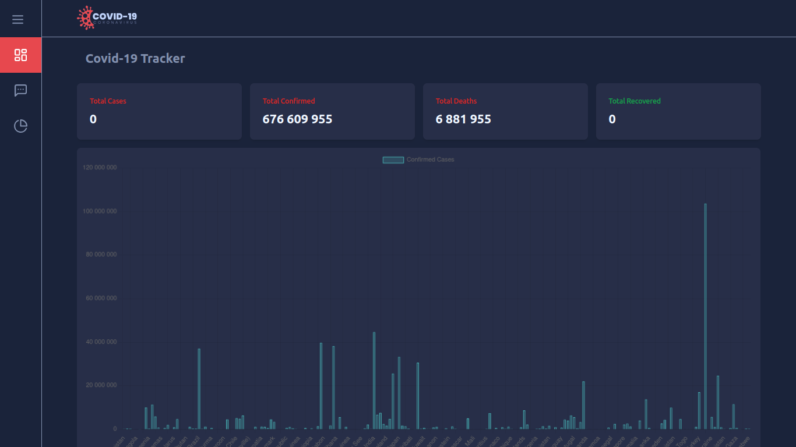
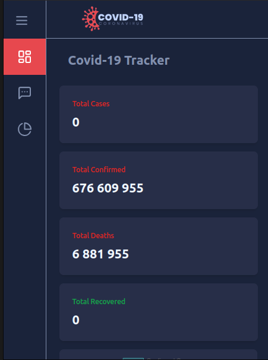

# COVID Tracker

<p align="center">
  
  
  
  


</p>

<p align="center">
  <a href="#about">About</a> •
  <a href="#installation">Installation</a> •
  <a href="#technologies">Technologies</a> •
  <a href="#author">Author</a>   
</p>

## About

This project is part of a challenge that aims to improve skills in Vue.js, Vite and Tailwind CSS. The goal is to develop an application that uses Vite and Tailwind CSS to present COVID-19 data from different countries in a bar chart. We will use the COVID API to obtain the necessary data.





## Installation

Before you begin, you will need to have the following tools installed on your machine: [Git](https://git-scm.com) and [Node.js](https://nodejs.org/en/). Also, it's good to have an editor to work with the code such as [VSCode](https://code.visualstudio.com/).

### 🎲 Running the Front End 

```bash
# Clone this repository
$ git clone https://github.com/Josemar-cafumana/covid-19.git

# Navigate to the project's folder in the terminal/cmd
$ cd covid-19

# Install dependencies
$ npm install
# If you prefer using Yarn, execute the following command
$ yarn

# Run the application in development mode
$ npm run dev
# If you prefer using Yarn, execute the following command
$ yarn dev

# The server will start on port 5173 - access <http://localhost:5173>
```


## Technologies

- [TypeScript](https://www.typescriptlang.org/): A superset of JavaScript that adds optional static typing.

- [Vue.js](https://vuejs.org/): A progressive JavaScript framework for building user interfaces.

- [ShadcnUI](https://shadcn-ui.vercel.app/): A UI component library for Vue.js.

- [Tailwind CSS](https://tailwindcss.com/): A utility-first CSS framework for rapidly building custom designs.

- [Vite](https://vitejs.dev/): A next-generation front-end tooling.


These technologies were chosen to provide an efficient development experience, making project creation easier.

## Author

<div align="center">

<h1>Josemar Cafumana</h1>
<strong>Backend Developer</strong>
<br/>
<br/>
<div  style="display: flex; align-items: center: justify-content: center; text-align: center">

<a href="https://www.linkedin.com/in/josemar-cafumana-web-developer/" target="_blank">

</a>

<a href="https://github.com/Josemar-cafumana" target="_blank">

</a>

<a href="mailto:rjosemar-cafumana@hotmail.com" target="_blank">

</a>

<a href="https://wa.link/65562r" target="_blank">

</a>

</a>
</div>

<br/>
<br/>
</div>